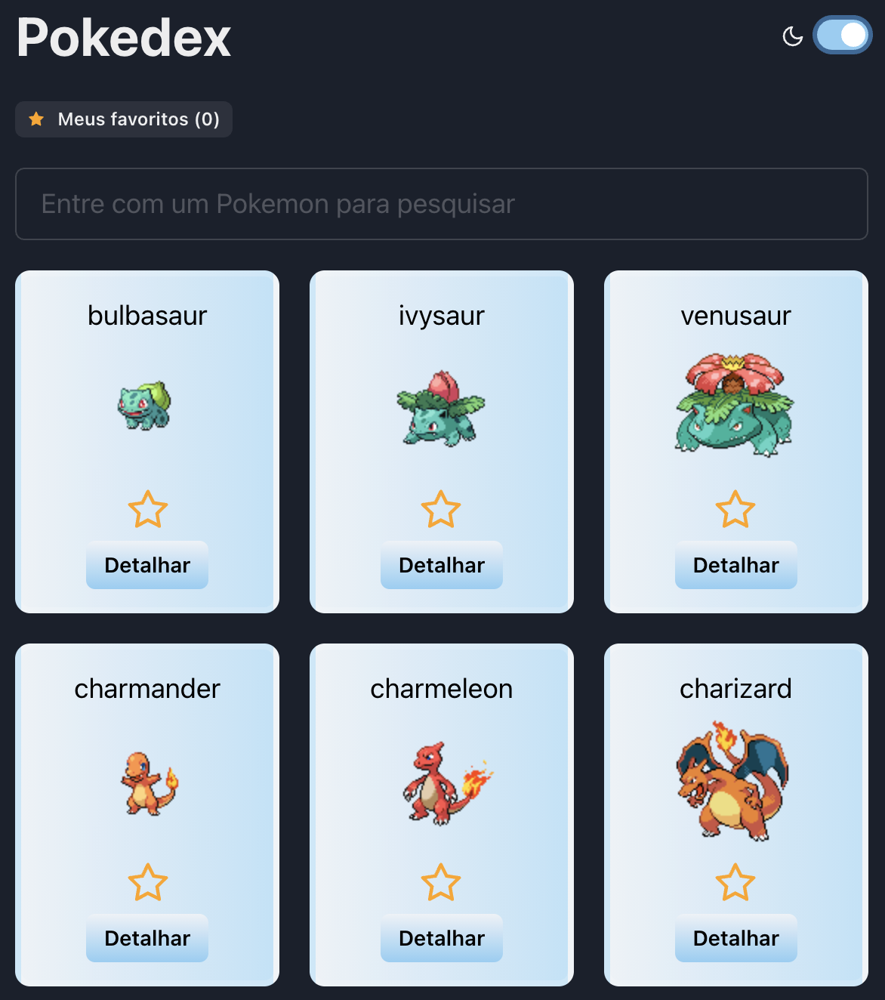

# React Pokedex
[](https://app.netlify.com/sites/react-pokedex-typescript/deploys)

Simple control to list, search, add and remove Pokemons into your Pokedex: https://react-pokedex-typescript.netlify.app



## Stack
- [Chakra](https://chakra-ui.com/) [layout]
- [Redux Toolkit](https://redux-toolkit.js.org/) [state management]
- [Axios](https://github.com/axios/axios) [request]
- [Jest](https://jestjs.io/) / [Enzyme](https://enzymejs.github.io/enzyme/) [testing]
- [Typescript with Standard](https://github.com/marlosirapuan/cra-template-typescript-standard-prettier) [cra template]
- [PokeAPI](https://pokeapi.co/api/v2)

---

## Getting started

If you have yarn installed in your machine.
```
yarn install
yarn start
```

Run tests:
```
yarn test
```

## Docker

If you prefer you can use Docker.
```
docker-compose up
```
Wait to finish the build and start the app in http://localhost:3000.
